# CampusDrop

**A delivery experience designed for students who can't always be there to receive their packages.**

An independent product design case study: user research, persona, journey map, wireframes, a small design system, and a clickable mobile prototype.

**Tools:** Google Forms, Figma, Lovable
**Designer:** Syed M Awez

- Live prototype: https://delivery-drop-in.lovable.app
- Case study page: https://syedawez-1.github.io/campusdrop-design-case-study/

> This is a design project, not a production app. It uses mock data and has no backend. It is not affiliated with any delivery company.

---

## 1. The problem

Hostel students order online regularly, but packages rarely arrive when they are in their rooms. Students are often in class when a delivery arrives. They get no reliable arrival time, struggle to explain exactly where they are, and have few options once a delivery is missed. The package is attempted again later, and the waiting starts over.

CampusDrop focuses on one specific moment: the last stretch of a delivery, when the student can't be present.

## 2. Research

I built a 14-question survey covering delivery location, ordering frequency, missed deliveries, what happens when students are unavailable, and what they would want to change. It was created with a Google Apps Script so it could be regenerated and reused, and I collected responses in person from hostel students.

**Honest scope:** these are initial findings from two undergraduate participants. They are directional input that shaped the design focus, not statistically representative evidence.

Findings:

- Both ordered online about 1 to 2 times a month and frequently missed deliveries.
- Both named not knowing the exact arrival time as a major problem, and both were dissatisfied with the current experience.
- Both wanted to see where the delivery currently was, and both sometimes struggled to explain their exact location.
- When unavailable, the delivery was simply attempted again later. Both would rather have an authorized friend or roommate receive it.
- Both wanted more control over delivery time or location, considered a service like this useful, and agreed to test a prototype.

## 3. Key insight

The problem is not receiving a package. It is not knowing when it will arrive, or having any control when the student can't be there.

That led to three design pillars:

| Pillar | The student's question |
|---|---|
| Visibility | Where is my package? |
| Predictability | When will it arrive? |
| Control | What can I do if I'm unavailable? |

**How might we** give college students greater visibility and control over their deliveries when they cannot be present to receive them?

## 4. Persona: The Unavailable Student

An undergraduate hostel student who orders online roughly 1 to 2 times a month. *Based on initial research.*

**Goals:** know when the package will arrive; track where it is right now; avoid missed deliveries; have someone trusted receive it; control delivery time or location.

**Pain points:** unpredictable arrival; missing deliveries during classes; difficulty explaining where they are; few alternatives after a missed delivery.

## 5. User journey

**Today:** order online, wait, "where is my package?", no clear arrival time, delivery arrives, student unavailable, missed delivery, attempted again, wait again.

**With CampusDrop:** order, track package, see estimated arrival, "3 stops away" notification, choose an alternative if unavailable (authorized person, campus pickup, or reschedule), package received.

Design principle: *don't make students wait for the delivery. Help them plan around it.*

## 6. From findings to screens

| What students said | What I designed |
|---|---|
| Arrival time is uncertain | An estimated arrival window and a count of deliveries ahead of yours |
| Deliveries are missed during class | A "3 stops away" notification that arrives while there is still time to act |
| They want to see where the delivery is | Current location and a progress timeline on the tracking screen |
| A friend or roommate should receive it | "I can't receive it" with an authorized-person option and a verification code |
| They want more control | Three recovery paths: authorized person, campus pickup point, or reschedule |

### Wireframes (Figma)

<table>
<tr>
<td align="center">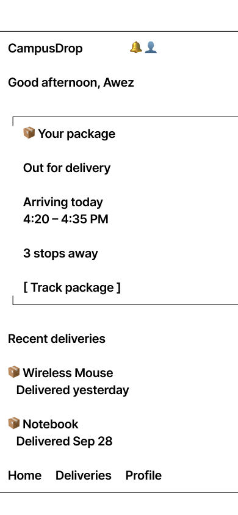 01 Home</td>
<td align="center">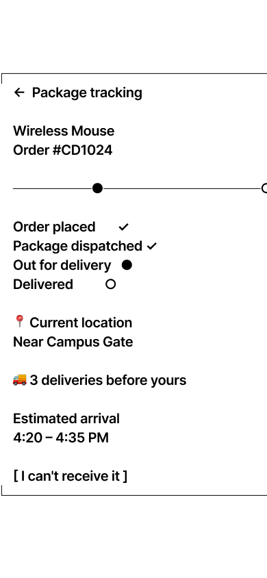 02 Package tracking</td>
<td align="center">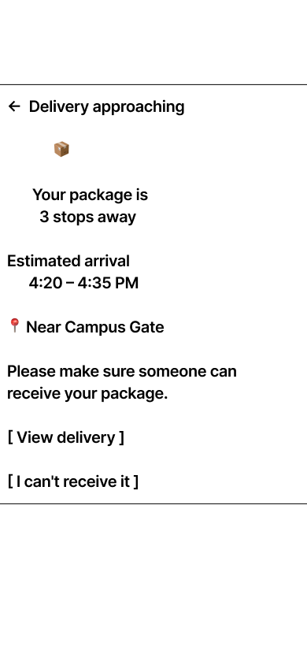 03 Delivery approaching</td>
<td align="center">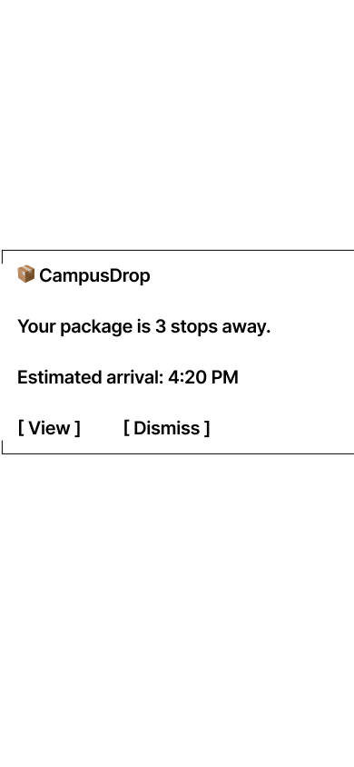 04 3 stops notification</td>
</tr>
<tr>
<td align="center">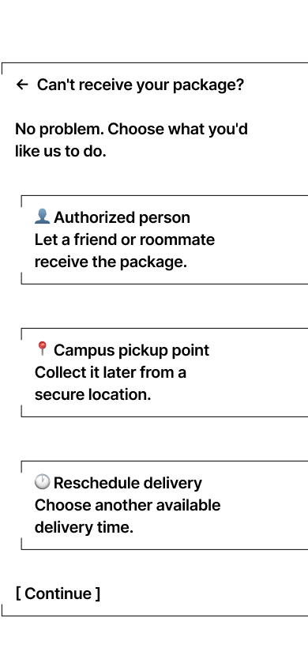 05 Can't receive</td>
<td align="center">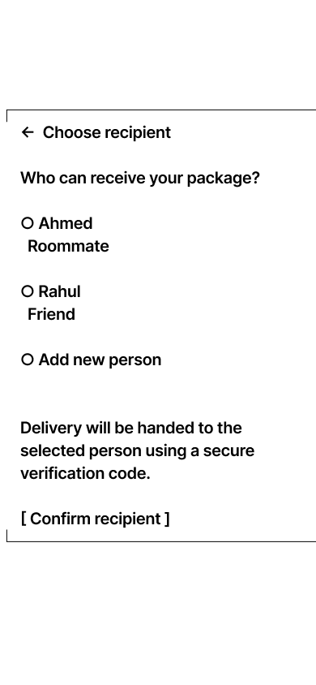 06 Choose recipient</td>
<td align="center">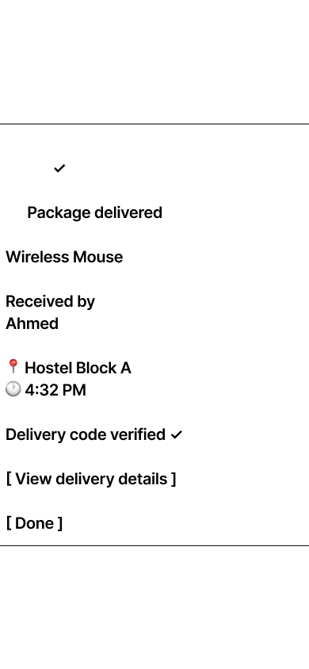 07 Delivery confirmation</td>
<td align="center">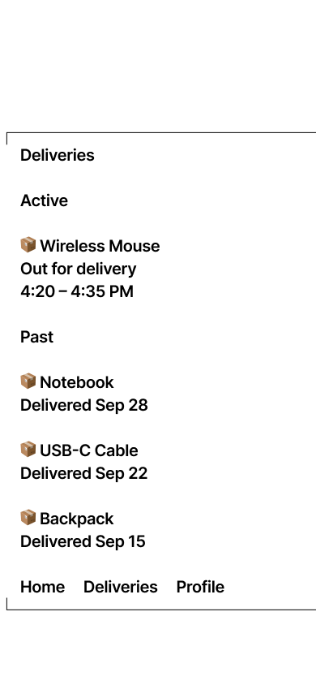 08 Delivery history</td>
</tr>
</table>

## 7. Design system

Small and consistent. Blue marks things the student can act on, green marks success, amber marks a warning. Status is always written out as well as colored.

| Token | Value |
|---|---|
| Primary | `#2563EB` |
| Text | `#111827` |
| Secondary text | `#6B7280` |
| Background | `#F9FAFB` |
| Success | `#16A34A` |
| Warning | `#F59E0B` |

Typography: Inter (heading 24, subheading 20, body 16, caption 14). Components: primary and secondary buttons, delivery card, status badges, delivery progress indicator, bottom navigation.

## 8. Final UI

I built the high-fidelity, mobile-first prototype in Lovable at 390 by 844, using reusable components and mock data, then audited every screen for hierarchy, consistency, spacing, labelling and accessibility.

<table>
<tr>
<td align="center">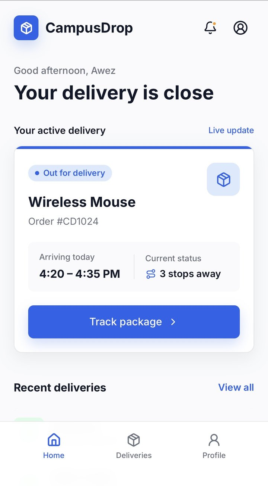 Home</td>
<td align="center">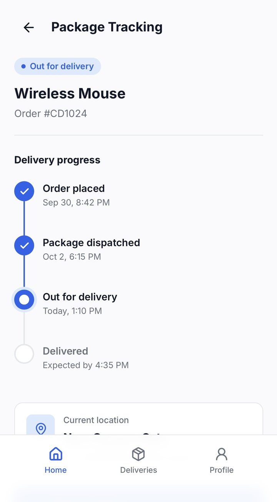 Package tracking</td>
<td align="center">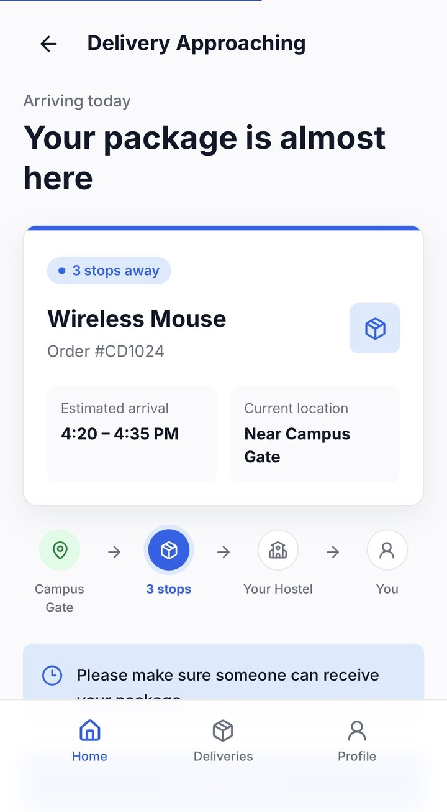 Delivery approaching</td>
<td align="center">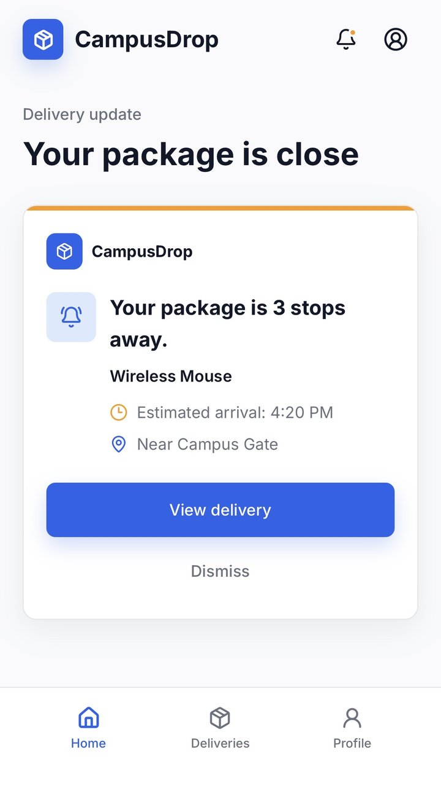 3 stops notification</td>
</tr>
<tr>
<td align="center">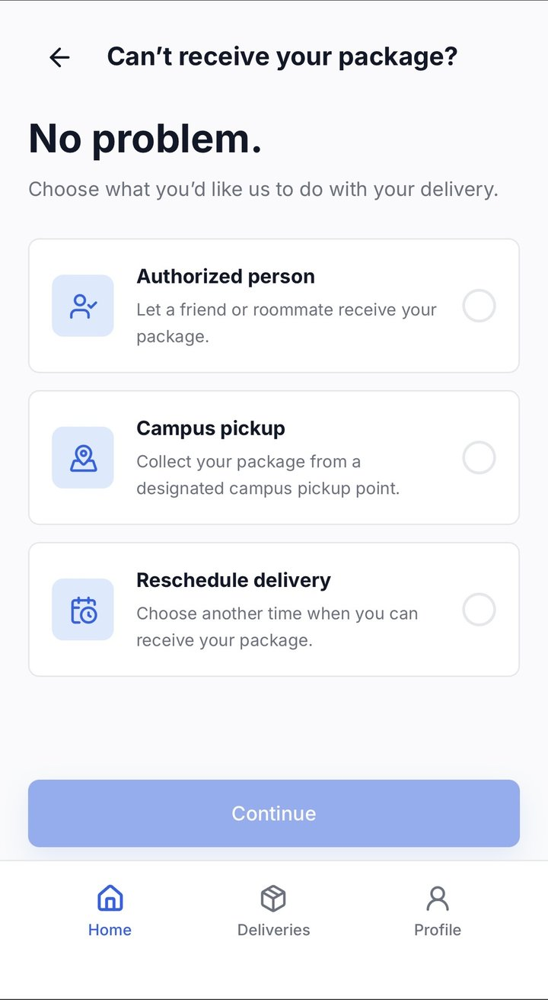 Can't receive</td>
<td align="center">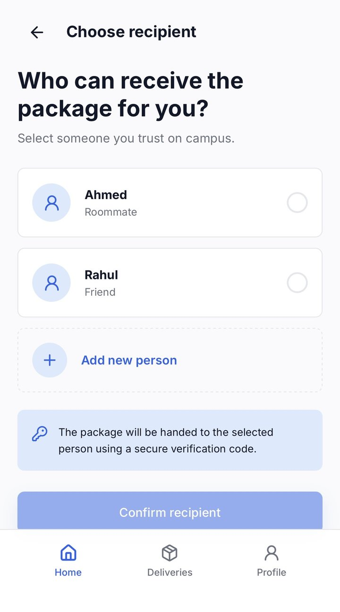 Choose recipient</td>
<td align="center">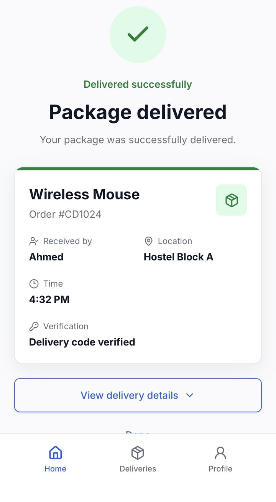 Delivery confirmation</td>
<td align="center">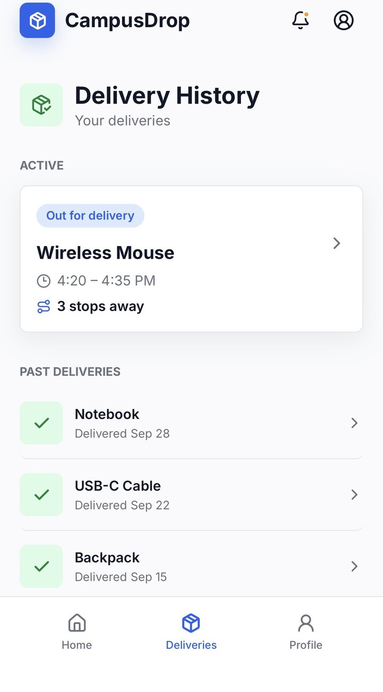 Delivery history</td>
</tr>
</table>

## 9. Prototype flow

Home, package tracking, delivery approaching, 3 stops away, can't receive, choose recipient, recipient confirmed, package delivered, delivery history.

[Open the live prototype](https://delivery-drop-in.lovable.app) to click through it.

**What I chose not to build:** live GPS, maps, payments, real delivery APIs, driver accounts and AI. Each would have added engineering work without answering a question the research had raised.

## 10. Reflection

CampusDrop taught me that effective product design is not only about making information easier to see. It is about giving users meaningful choices when circumstances change. It also reinforced the importance of connecting research findings to specific design decisions rather than adding features without a clear user need.

**What I would do next**

- Run usability tests with the participants who volunteered, and record where they hesitate on the recipient and verification-code steps.
- Widen the survey beyond two responses so the findings can be checked against more students.
- Test the interface with assistive technology, and check color contrast on every status color.
- If built, compare missed-delivery rate and how often students pick a fallback option before and after the "3 stops away" notification.

---

Syed M Awez - awezsyed93@gmail.com - [github.com/syedawez-1](https://github.com/syedawez-1)
